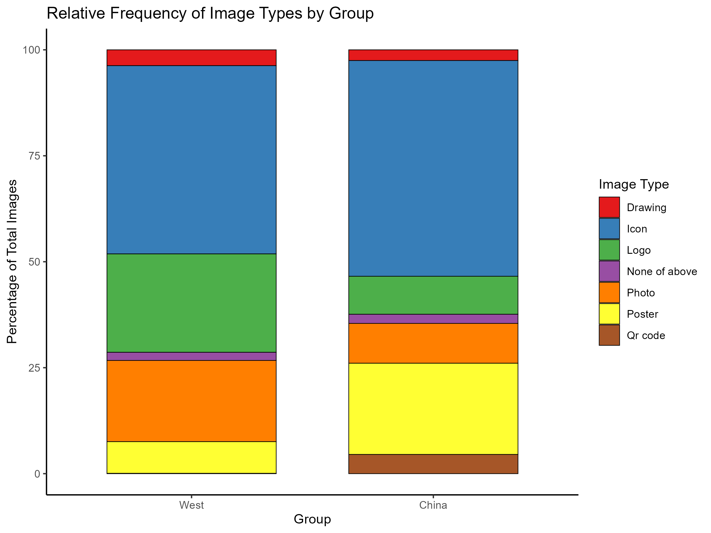

# Reproducing Image Type Analysis from: *Looks matter! A Comparative Analysis of Image Use on Chinese and Western Municipal Websites*

This repository reproduces the data analysis and visualization from the following publication:

> **Li, Y., Karreman, J., & de Jong, M. (2024).** *Looks matter! A Comparative Analysis of Image Use on Chinese and Western Municipal Websites.* Proceedings of the 2024 IEEE International Professional Communication Conference (ProComm), 59–66. https://doi.org/10.1109/ProComm61427.2024.00018 

---

## 🧪 Research Overview

This research investigates how municipal websites in **China** and the **West** use visual imagery differently. It compares **seven types of images** across 100 Chinese and 100 Western municipal homepages.

### 🔍 Image Type Definitions

| Image Type       | Description                                                                 |
|------------------|-----------------------------------------------------------------------------|
| **Drawing**       | Hand-drawn illustrations or clipart graphics                                |
| **Icon**          | Functional icons used in navigation or menus                                |
| **Logo**          | City or governmental brand marks                                            |
| **None of above** | No images present                                                           |
| **Photo**         | Realistic photographs (e.g., people, cityscapes)                            |
| **Poster**        | Promotional banners or political campaign posters                           |
| **QR code**       | Scannable codes linking to external resources                               |

---

## 📊 Key Findings

- **Chinese municipal websites** contain **more images overall** than Western sites.
- **Icons** and **posters** are used more frequently on Chinese websites.
- **Photos** and **no imagery** are more common on Western sites.



📈 The visual breakdown is available at: `outputs/figures/percentage_image_type.png`.

---


## 📁 Project Structure

| 📁 Folder            | 📄 File                                             | 📝 Description                                                      |
|---------------------|-----------------------------------------------------|----------------------------------------------------------------------|
| `R script/`         | `analysis.Rmd`                                      | Main R Markdown file for data cleaning, analysis, and visualization |
| `data/`             | `2.2.4.1 West image type.csv`                        | Image type data collected from Western municipal websites            |
|                     | `2.2.4.2 Chinese image type.csv`                     | Image type data collected from Chinese municipal websites            |
| `outputs/figures/`  | `percentage_image_type.png`                          | Bar plot comparing image type distributions between groups           |
| `outputs/`          | `published figures & tables for reproduction.png`   | Exported results directly used in the publication                    |
| `outputs/tables/`   | `chi_square_summary.csv`                             | Summary of Chi-square test and Cramér's V statistic                  |
|                     | `crosstable_result.txt`                              | Detailed CrossTable results from `gmodels`                           |
| *(root)*            | `.RData`                                             | R workspace image (auto-generated by R)                              |
| *(root)*            | `.Rhistory`                                          | Command history (auto-generated by R)                                |
| *(root)*            | `.Rprofile`                                          | R configuration profile (optional custom settings)                   |
| *(root)*            | `municipal-analysis.Rproj`                           | RStudio project file                                                 |
| *(root)*            | `renv.lock`                                          | Lockfile capturing package versions for reproducibility              |
| *(root)*            | `LICENSE`                                            | MIT License for open academic use                                    |
| *(root)*            | `README.md`                                          | Project overview, instructions, and licensing                        |


---

## ▶️ How to Reproduce This Analysis

### 📦 Step 1: Install R and RStudio

Make sure R (≥ 4.1.0) and RStudio are installed on your machine.

### 📥 Step 2: Clone This Repository

```bash
git clone https://github.com/suntarliarzn/municipal-image-analysis.git
cd municipal-image-analysis
```
### 🔄 Step 3: Restore the Reproducible Environment
```r
install.packages("renv")
renv::restore()
```

### 🧮 Step 4: Run the Analysis
Open the RStudio project `municipal-image-analysis.Rproj` \
Then open and run: `R script/analysis.Rmd`

All visual and statistical outputs will be saved under the `outputs/` directory.


## 📬 Contact
Yaxing Li\
PhD Researcher, University of Twente\
📧 yaxing.li@utwente.nl\
🌐 ORCID: 0000-0002-6750-8429


<!--EndFragment-->
